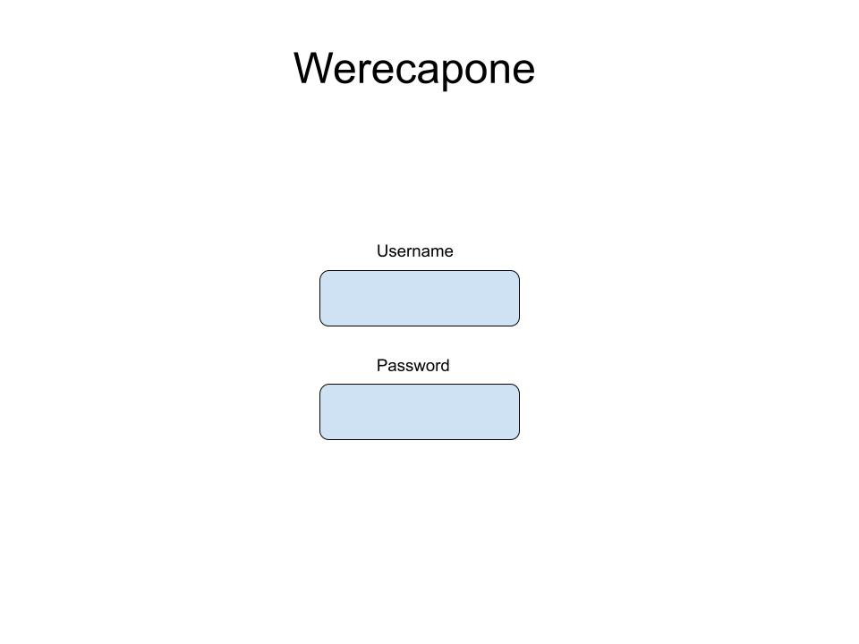
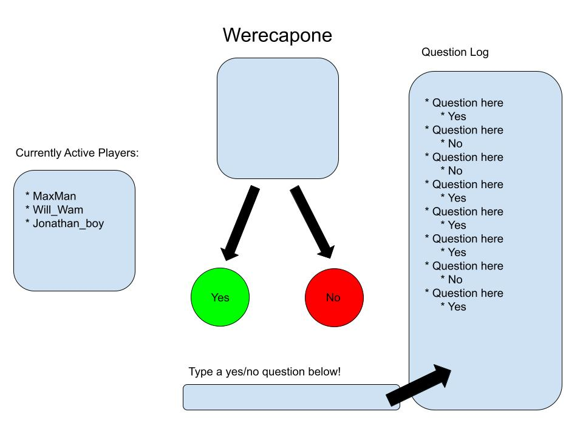
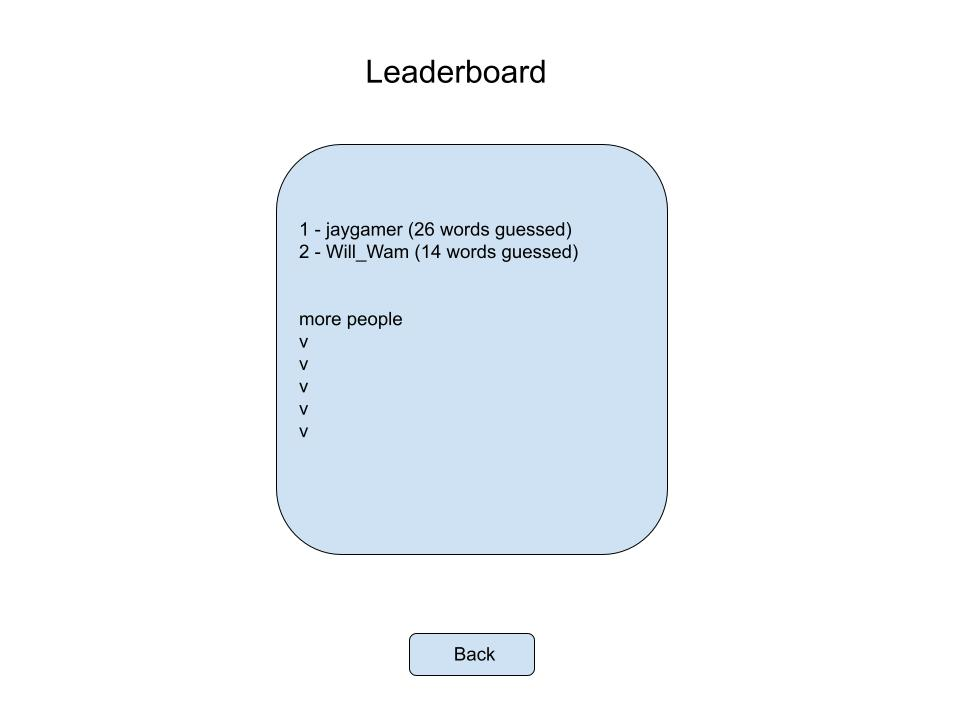

# Werecapone

### Elevator pitch

Remember the classic game "20 Questions"? What fun! But… it gets boring to play 20 questions with just you and a friend, or with just you and a computer. 
Werecapone is a real-time multiplayer word guessing game, where everyone in the world can play as the question-givers, all at the same time! Integrated with the ChatGPT API, the website will generate a word (could be a famous person, place, verb, adjective, concept/idea, etc.), and return the answer "yes", "no", or "maybe" to any question asked. When someone asks a question, the question and corresponding answer will be displayed to everyone else, and logged so that all players can work together to guess the word. As soon as the word is guessed, the player who guessed it gains points based on the difficulty of the word, and those points persist in the player's account for all to see in the leaderboard. Then, a new word is served up and the fun never stops!

### Login Page Design

### Gameplay Page Design

### Leaderboard Page Design

### Key features

- Secure login with username/password over HTTPS
- Ability to type in and submit a question
- Display of the answer received
- Ability to see all previous answers for questions asked
- Leaderboard section with top player scores (persistently stored)

### Technologies

I am going to use the required technologies in the following ways.

- **HTML** - There will be three HTML pages: one for login, one for playing the game (submit questions / see answers), and one for viewing the leaderboard.
- **CSS** - The app will follow a visually appealing color theme, and all input and other components will be styled to be accessible for different screen sizes.
- **JavaScript** - Provides login, submitting questions, receiving answers from the API, display other users' questions/answers
- **Service** - Backend service with endpoints for:
  - login
  - retrieving questions/answers
  - retrieving point value per player
- **DB** - Store users, questions, answers, point scores in database.
- **Login** - Register and login users. Credentials securely stored in database. Can't ask questions unless authenticated.
- **WebSocket** - In real time, when each user asks a question, their question will be displayed to other users.
- **React** - Application will use the React web framework.

## HTML deliverable

For this deliverable I added the application structure.

- **HTML pages** - Four HTML pages: Login, Playing the Game, Viewing the Leaderboard, About.
- **Links** - Each of the 4 pages links to all others.
- **Text** - Instructions for how to play, description about the game, leaderboard/username statistics, and questions/answers log are all represented with text.
- **Images** - There is a robot image representing the AI in gameplay, and checkmarks and x's indicating yes/no answers.
- **Login** - Input boxes for username and password and submit button for login.
- **Database** - The previous questions asked and answered represent data pulled from the database.
- **WebSocket** - The realtime count of users and their usernames represents data from the websocket.

## CSS deliverable

For this deliverable I properly styled the application into its final appearance.

- **Header, footer, and main content body**
- **Navigation elements** - I made a button group along the top and styled it with a primary color for the selected page and a brighter color when hovered over.
- **Responsive to window resizing** - All portions of the app fit the screen size using flex and changing width properties.
- **Application elements** - Elements are spaced out nicely from each other, with nice looking borders and most content contained within separate panels.
- **Application text content** - Consistent fonts are used (one for headers, and one for normal text) across all pages. Colors are also consistent.
- **Application images** - There aren't many images, but the ones that there are are well sized and fit the color scheme.

## JavaScript deliverable

For this deliverable I added javascript to all 4 pages to add functonality.

- **login** - When you press the login or sign up button it takes you to the play page. It also saves your entered username and displays it in the footer on every page from then on. You are effectively "signed in"
- **database** - Added javascript functions to populate arrays (in the future will populate with database data), in order to fill in the previous questions/answers log and leaderboard table of high scores.
- **WebSocket** - Interval is set to simulate new players joining live, so that they can be viewed in the "active players" section in play page.
- **application logic** - The submit question button and input bar are attached to the answer log panel, so that whenever you press enter it adds it to the list of previously asked questions. Right now, it just picks a random answer of "yes", "no", or "maybe" to anything you type in.

## Service deliverable

For this deliverable I created an HTTP service to host my frontend and provide backend endpoints.

- **Node.js/Express HTTP service** - Done!
- **Static middleware for frontend** - Done!
- **Calls to third party endpoints** - The front end calls a random word generator API (https://random-word-api.vercel.app/api?words=1). Due to the hidden nature of the word for the game, the word is not displayed on screen but can currently be seen in the console in a console.log. 
- **Backend service endpoints** - Endpoints are implemented for retrieving the log of previously asked qeustions and their answers, posting new questions to the log, getting the list of players' scores, setting the new word that users are supposed to be guessing, and guessing the word. 
- **Frontend calls service endpoints** - The frontend calls the service endpoints in order to retrieve what the current secret word is, set a new secret word, load up the list of previously asked questions. 

## DB deliverable

For this deliverable I stored and retrieved data from MongoDB.

- **MongoDB Atlas database created** - done!
- **Endpoints for data** - Endpoints call functions such as askQuestion that now process the data and send it to and retrieve fromMongo.
- **Stores data in MongoDB** - done!

## Login deliverable

For this deliverable I added user registration and authentication.

- **User registration** - Creates a new account in the database.
- **existing user** - Verifies the user's name and password from data stored in the database
- **Use MongoDB to store credentials** - done!
- **Restricts functionality** - Your scores will never be saved/incremented unless you're logged in

## WebSocket deliverable

For this deliverable I enabled realtime reporting of active players when a user joins

- **Backend listens for WebSocket connection** - done!
- **Frontend makes WebSocket connection** - done!
- **Data sent over WebSocket connection** - done!
- **WebSocket data displayed** - When a new player joins (becomes active on the site), their username will pop up on all other users' active players tab